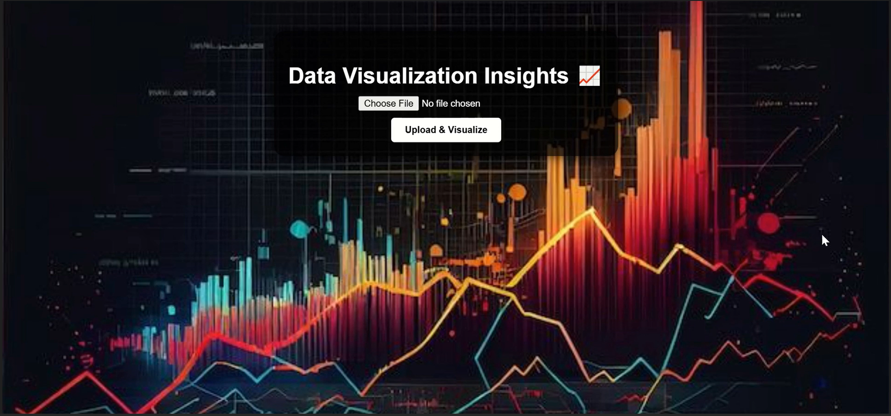

# 📊 Data Visualization Insights – Python Flask Mini Project  

An interactive and dynamic web app that transforms **raw datasets into meaningful insights** through charts and visual reports.🌐Crafted to make data **simple, visual, and powerful** — turning every dataset into a story that drives smarter decisions.💡🔥  

## 🚀 Features  

- Upload **CSV & Excel datasets**📂  
- Automatic generation of **4 insightful charts** (bar, line, scatter, pie — depending on data)📈📉  
- Clean **black transparent dashboard UI** with centered visualization🎨  
- Supports **different datasets** (adapts charts dynamically)🧠  
- Responsive, interactive, and beginner-friendly🌐  

## 🛠️ Tech Stack  

- **Frontend**: HTML5, CSS3 
- **Backend**: Python (Flask)  
- **Libraries**: Pandas, Matplotlib, Seaborn  

## 📸 Screenshot  

  
